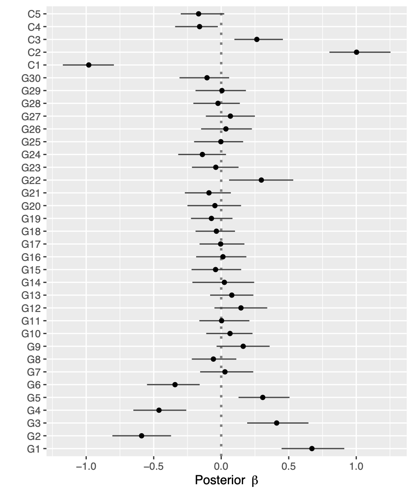
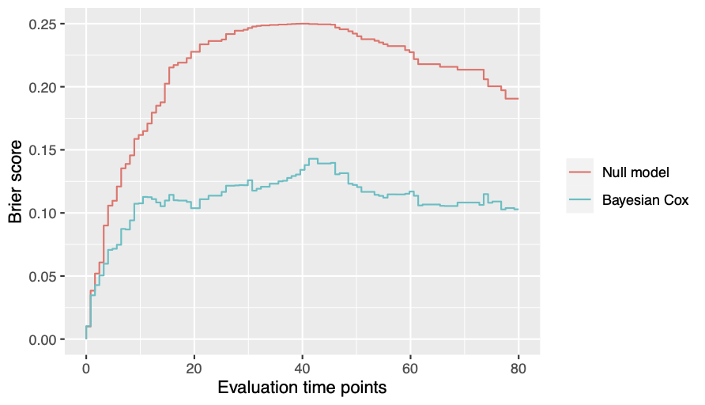

# psbcSpeedUp

[](https://cran.r-project.org/package=psbcSpeedUp)
[](https://ocbe-uio.r-universe.dev/psbcSpeedUp)
[](https://github.com/ocbe-uio/psbcSpeedUp/actions)
[](https://www.gnu.org/licenses/gpl-3.0)
[](https://doi.org/10.32614/CRAN.package.psbcSpeedUp)

This is a C++ speed-up and extended version of the R-pakcage [psbcGroup](https://CRAN.R-project.org/package=psbcGroup).
It implements the Bayesian Lasso Cox model ([Lee et al., 2011](https://doi.org/10.2202/1557-4679.1301)) and the Bayesian Lasso Cox with mandatory variables ([Zucknick et al., 2015](https://doi.org/10.1002/bimj.201400160)).
Bayesian Lasso Cox models with other shrinkage and group priors ([Lee et al., 2015](https://doi.org/10.1002/sam.11266)) are to be implemented later on.

## Installation

Install the latest released version from [CRAN](https://CRAN.R-project.org/package=psbcSpeedUp)

```r
install.packages("psbcSpeedUp")
```

Install the latest development version from GitHub

```r
#install.packages("remotes")
remotes::install_github("ocbe-uio/psbcSpeedUp")
```

## Examples

### Run a Bayesian Lasso Cox with mandatory variables

Data set `exampleData` consists of six components:
survival times `t`,
event status `di`,
covariates `x`,
number of genomics variables `p`,
number of clinical variables `q` and
true effects of covariates `beta_true`.
See `?exampleData` for more information of the data.

To run a Bayesian Lasso Cox model for variable selection of the first $p$ genomics variables and inclusion of $q$ mandatory variables, one can specify arguments of the main function `psbcSpeedUp()` with `p = p` and `q = q`.
If the arguments `p` and `q` are unspecified, the Bayesian Lasso Cox model does variable selection for all covariates, i.e., by default `p = ncol(survObj$x)` and `q = 0`.

```r
# Load the example dataset
data("exampleData", package = "psbcSpeedUp")
p <- exampleData$p
q <- exampleData$q
survObj <- exampleData[1:3]

# Set hyperparameters (see help file for specifying more hyperparameters)
mypriorPara <- list('eta0'=0.02, 'kappa0'=1, 'c0'=2, 'r'=10/9, 'delta'=1e-05,
'lambdaSq'=1, 'sigmaSq'= runif(1, 0.1, 10), 'beta.prop.var'=1, 'beta.clin.var'=1)

# run Bayesian Lasso Cox
library("psbcSpeedUp")
set.seed(123)
fitBayesCox <- psbcSpeedUp(survObj, p=p, q=q, hyperpar=mypriorPara,
nIter=1000, burnin=500, outFilePath="/tmp")
```

```
Running MCMC iterations ...
[##################################################] 100%
DONE, exiting!
```

### Plot posterior estimates of regression cofficients

The function `psbcSpeedUp::plot()` can show the posterior mean and 95% credible intervals of regression coefficients.

```r
plot(fitBayesCox)
```




### Plot time-dependent Brier scores

The function `psbcSpeedUp::plotBrier()` can show the time-dependent Brier scores based on posterior mean of coefficients or Bayesian model averaging.

```r
plotBrier(fitBayesCox, times = 80)
```
```
    Null.model Bayesian.Cox
IBS  0.2089742     0.109274
```




### Predict survival probabilities and cumulative hazards

The function `psbcSpeedUp::predict()` can estimate the survival probabilities and cumulative hazards.

```r
predict(fitBayesCox, type = c("cumhazard", "survival"))
```
```
##        observation   times cumhazard  survival
##     1:           1   0.264  1.08e-05  1.00e+00
##     2:           2   0.264  4.50e-05  1.00e+00
##     3:           3   0.264  5.33e-05  1.00e+00
##     4:           4   0.264  1.84e-05  1.00e+00
##     5:           5   0.264  7.22e-05  1.00e+00
##    ---                                        
## 39996:         196 107.641  2.66e+00  6.97e-02
## 39997:         197 107.641  5.47e-01  5.79e-01
## 39998:         198 107.641  5.15e+01  4.41e-23
## 39999:         199 107.641  4.13e+02 5.72e-180
## 40000:         200 107.641  2.24e-01  7.99e-01
```


## References

> Kyu Ha Lee, Sounak Chakraborty, Jianguo Sun (2011).
> Bayesian variable selection in semiparametric proportional hazards model for high dimensional survival data.
> _The International Journal of Biostatistics_, 7:1. DOI: [10.2202/1557-4679.1301](https://doi.org/10.2202/1557-4679.1301).

> Kyu Ha Lee, Sounak Chakraborty, Jianguo Sun (2015).
> Survival prediction and variable selection with simultaneous shrinkage and grouping priors.
> _Statistical Analysis and Data Mining_, 8:114-127. DOI:[10.1002/sam.11266](https://doi.org/10.1002/sam.11266).

> Manuela Zucknick, Maral Saadati, Axel Benner (2015).
> Nonidentical twins: Comparison of frequentist and Bayesian lasso for Cox models.
> _Biometrical Journal_, 57:959-981. DOI:[10.1002/bimj.201400160](https://doi.org/10.1002/bimj.201400160).