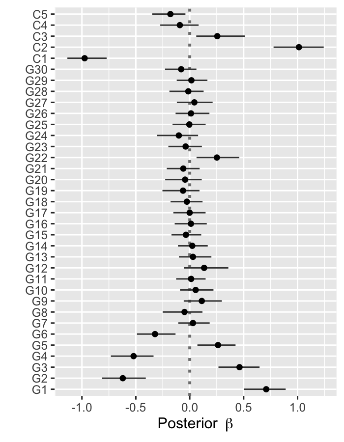
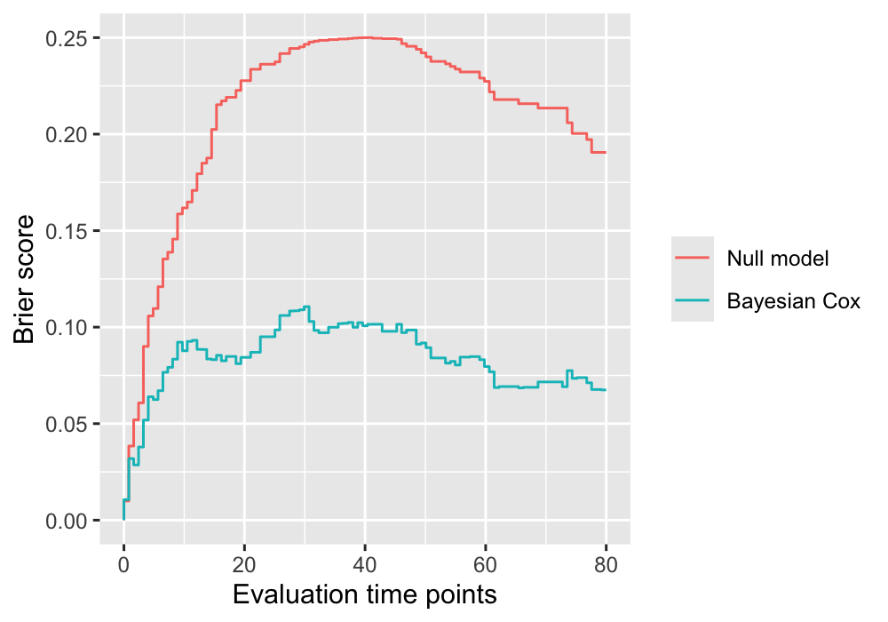

```{r setup, include=FALSE}
knitr::opts_chunk$set(echo = TRUE, eval = FALSE)
options(rmarkdown.html_vignette.check_title = FALSE)
```

This is a C++ speed-up and extended version of the R-package [psbcGroup](https://CRAN.R-project.org/package=psbcGroup).
It implements the Bayesian Lasso Cox model ([Lee et al., 2011](https://doi.org/10.2202/1557-4679.1301)) and the Bayesian Lasso Cox with mandatory variables ([Zucknick et al., 2015](https://doi.org/10.1002/bimj.201400160)).
Bayesian Lasso Cox models with other shrinkage and group priors ([Lee et al., 2015](https://doi.org/10.1002/sam.11266)) are to be implemented later on.

## Installation

Install the latest released version from [CRAN](https://CRAN.R-project.org/package=psbcSpeedUp)

```{r install1, eval = FALSE}
install.packages("psbcSpeedUp")
```

Install the latest development version from GitHub

```{r install2, eval = FALSE}
# install.packages("remotes")
remotes::install_github("ocbe-uio/psbcSpeedUp")
```

## Examples

### Run a Bayesian Lasso Cox with mandatory variables

Data set `exampleData` consists of six components:
survival times `t`,
event status `di`,
covariates `x`,
number of genomics variables `p`,
number of clinical variables `q` and
true effects of covariates `beta_true`.
See `?exampleData` for more information of the data.

To run a Bayesian Lasso Cox model for variable selection of the first $p$ genomics variables and inclusion of $q$ mandatory variables, one can specify arguments of the main function `psbcSpeedUp()` with `p = p` and `q = q`.
If the arguments `p` and `q` are unspecified, the Bayesian Lasso Cox model does variable selection for all covariates, i.e., by default `p = ncol(survObj$x)` and `q = 0`.

```{r, results='hide', warning=FALSE}
# Load the example dataset
data("exampleData", package = "psbcSpeedUp")
p <- exampleData$p
q <- exampleData$q
survObj <- exampleData[1:3]

# Set hyperparameters (see help file for specifying more hyperparameters)
mypriorPara <- list(
  "eta0" = 0.02, "kappa0" = 1, "c0" = 2, "r" = 10 / 9, "delta" = 1e-05,
  "lambdaSq" = 1, "sigmaSq" = runif(1, 0.1, 10), "beta.prop.var" = 1, "beta.clin.var" = 1
)

# run Bayesian Lasso Cox
library("psbcSpeedUp")
set.seed(123)
fitBayesCox <- psbcSpeedUp(survObj,
  p = p, q = q, hyperpar = mypriorPara,
  nIter = 1000, burnin = 500, outFilePath = "/tmp"
)
```


### Plot posterior estimates of regression coefficients

The function `psbcSpeedUp::plot()` can show the posterior mean and 95% credible intervals of regression coefficients.

```{r, fig.width=5, fig.height=8}
plot(fitBayesCox)
```
```{r eval=FALSE, echo=FALSE}
png("estimate_beta.png", bg = "transparent", width = 700, height = 900, res = 200)
plot(fitBayesCox)
dev.off()
```




### Plot time-dependent Brier scores

The function `psbcSpeedUp::plotBrier()` can show the time-dependent Brier scores based on posterior mean of coefficients or Bayesian model averaging.

```{r, fig.width=6, fig.heigh=5}
plotBrier(fitBayesCox, times = 80)
```
```{r eval=FALSE, echo=FALSE}
png("estimate_brier.png", bg = "transparent", width = 1000, height = 700, res = 200)
plotBrier(fitBayesCox, times = 80)
dev.off()
```

```
##     Null.model Bayesian.Cox
## IBS  0.2089742   0.08276646
```




### Predict survival probabilities and cumulative hazards

The function `psbcSpeedUp::predict()` can estimate the survival probabilities and cumulative hazards.

```{r}
predict(fitBayesCox, type = c("cumhazard", "survival"))
```
```
##        observation   times cumhazard  survival
##              <int>   <num>     <num>     <num>
##     1:           1   0.264  8.39e-06  1.00e+00
##     2:           2   0.264  4.09e-05  1.00e+00
##     3:           3   0.264  4.84e-05  1.00e+00
##     4:           4   0.264  2.44e-05  1.00e+00
##     5:           5   0.264  7.22e-05  1.00e+00
##    ---                                        
## 39996:         196 107.641  2.18e+00  1.14e-01
## 39997:         197 107.641  6.28e-01  5.34e-01
## 39998:         198 107.641  4.95e+01  3.15e-22
## 39999:         199 107.641  4.17e+02 9.71e-182
## 40000:         200 107.641  3.00e-01  7.41e-01
```

## References

> Kyu Ha Lee, Sounak Chakraborty, Jianguo Sun (2011).
> Bayesian variable selection in semiparametric proportional hazards model for high dimensional survival data.
> _The International Journal of Biostatistics_, 7:1. DOI: [10.2202/1557-4679.1301](https://doi.org/10.2202/1557-4679.1301).

> Kyu Ha Lee, Sounak Chakraborty, Jianguo Sun (2015).
> Survival prediction and variable selection with simultaneous shrinkage and grouping priors.
> _Statistical Analysis and Data Mining_, 8:114-127. DOI:[10.1002/sam.11266](https://doi.org/10.1002/sam.11266).

> Manuela Zucknick, Maral Saadati, Axel Benner (2015).
> Nonidentical twins: Comparison of frequentist and Bayesian lasso for Cox models.
> _Biometrical Journal_, 57:959-981. DOI:[10.1002/bimj.201400160](https://doi.org/10.1002/bimj.201400160).


